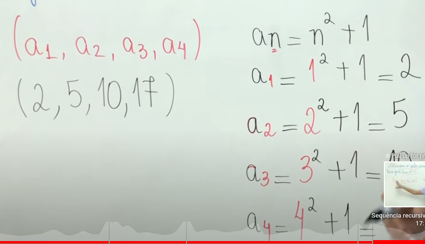

Matematica =>
- Sequencia Numerica =>
- - Eh um conjunto formado por elementos considerados em uma determinada ordem.
Ex => 3 + 6 + 12 + 24 = Somo o Dobro depois o Dobro, foi duplicando.

- Sequencia Recursiva => Para eu descobrir derminado termo, eu preciso saber
o termo anterior.
Ex => A1, A2, A3, A4
FORMULA Sequencia Recursiva => AN = n2(n ao quadrado) + 1;

Referencia = https://www.youtube.com/watch?v=mE6_YVkTDr0

Programacao => Após conhecer a técnica de recursividade, chegou o momento de implementar o programa para os matemáticos do laboratório onde trabalha. 

Lembre-se: foi solicitado a você implementar um programa que resolve se um número é primo ou não, porém, usando funções recursivas de cauda.

Para implementar essa solução, você precisa de um programa que solicite ao usuário um número.

Você pode seguir os seguintes passos para a implementação:

crie a função ehPrimo() de modo que ela receba um parâmetro, o valor a ser verificado e retorne um número inteiro: int ehPrimo(int n)
crie uma função auxiliar ehPrimoAux(), que recebe, além do valor a ser verificado, um inteiro x, inicialmente 2, que será utilizado para calcular os divisores de 2 até n.
caso o número n seja divisível por x, então, a função deve retornar o valor 0, informando que o número não é um primo. Caso isso não aconteça até que x seja igual a n, então retorna-se 1.

Exemplos do que podemos fazer =>
- Fibonacci